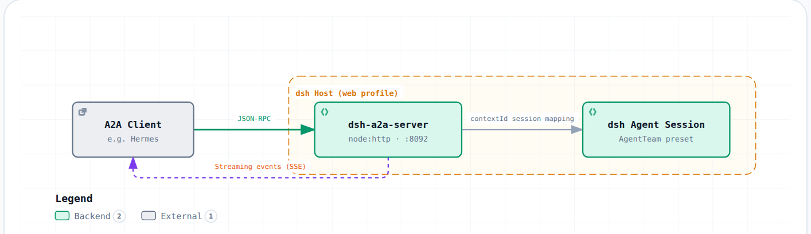

# dsh-a2a-server

**English** | [简体中文](README.md)

A server plugin library that exposes dsh agent sessions through the A2A
(Agent2Agent) protocol to remote agents (such as Hermes), enabling the
"Hermes = brain, dsh = arms" interoperability.

## Preview

The following effects are driven by this library's A2A server and streaming
events; client-side rendering is done by
[hermes-a2a-bridge](https://github.com/ArtomYuan/hermes-a2a-bridge) (code-block
rendering of tool commands / execution results / final text, and progress pushed
to Feishu / QQ).

### Live stream

When a dsh task is submitted, the client consumes the SSE stream and pushes
intermediate progress back to the messaging surface in real time. The live
sequence a user sees in Feishu / QQ looks like this (commands and results are
rendered as code blocks):

```
🚀 开始执行
🧠 思考中…
🔧 `bash`                    <- tool call, command in a code block
    ┌─ ```bash
    │  ls -la /tmp
    └─ ```
📋 `bash` 完成               <- tool result, output in a code block
    ┌─ ```
    │  total 4
    │  drwxrwxrwt  2 root root 40 Sep 11 14:00 .
    └─ ```
📖 输出完成                  <- long result rendered as a code block
✅ 完成
```

Long text exceeding the gateway's per-message limit is split at code-block
boundaries; continuation chunks are joined with a `⏩ 续` marker, so code blocks
never break across chunks.

### Code blocks

Operation content — tool commands, execution results, and final text — is
automatically rendered as code blocks:

- **Feishu**: fenced content triggers post rich text; code blocks are scrollable;
- **QQ / other mainstream gateways**: markdown code blocks render as code blocks;
- **plain-text platforms**: automatically degraded to plain text (no garbling).

Sample code-block content (an `ls -la` output block):

```text
total 4
drwxrwxrwt  2 root root 40 Sep 11 14:00 .
drwxrwxrwt  2 root root 40 Sep 11 14:00 ..
-rw-r--r--  1 root root  0 Sep 11 14:00 demo.txt
```

> Actual rendering depends on each gateway's client.

### Event stream

The streaming event form produced by this library (under
`SendStreamingMessage`: text Part + data Part private extension; fields taken from
the source `StreamEventDescriptor`):

```
artifactUpdate  artifactId: "stream-text"  append: true         <- text chunk, text Part
artifactUpdate  artifactId: <uuid>  mediaType: application/json  <- intermediate event, data Part
  kind: "tool_call"    { turn, step, name, arguments }
  kind: "tool_result"  { turn, step, name, text }
  kind: "thinking"     { turn, step, text }
  kind: "turn_start"   { turn, step }
  kind: "turn_end"     { turn, step, reason? }
statusUpdate   submitted → working → completed
```

See [CONFIGURATION.en.md](CONFIGURATION.en.md) for full fields and mechanics.

## Architecture



## Relationship with hermes-a2a-bridge

This library exposes a standard A2A interface and does not depend on any specific
client — other A2A clients can call it directly. Hermes users who want the full
experience (live progress / session continuity / single execution) can pair it with
[hermes-a2a-bridge](https://github.com/ArtomYuan/hermes-a2a-bridge). The two libraries
are not hard-bound; combine them as needed:

| Combination | What you get |
| --- | --- |
| This library only | A standard A2A interface callable by any A2A client |
| With hermes-a2a-bridge | Full experience: task submission + live progress + session continuity + single execution |

## Versions & Support

| Plugin version | Supported dsh |
| --- | --- |
| **0.3.x** (current) | **0.1.5-rc.2 ∥ 0.2.0-rc.2** — both runtimes in parallel; no plugin change needed |
| 0.2.x | 0.1.x |

Since 0.3.0, moving between dsh 0.1.5 and 0.2.0 (in either direction) requires no
plugin change; see [CONFIGURATION.en.md](CONFIGURATION.en.md) for mechanics.

## Installation

This library is an independent public bundle package (not a package inside the dsh
workspace), distributed as a standalone bundle.

1. Install it into a dsh profile (choose one):

   - **From npm (recommended)**:

     ```sh
     dsh plugin --profile <name> add @artomyuan/dsh-a2a-server
     ```

     Pin a version when needed: `dsh plugin --profile <name> add @artomyuan/dsh-a2a-server@0.3.0`.

   - **From the GitHub source** (to try unreleased changes; **the commit must be pinned**):

     ```sh
     dsh plugin --profile <name> add github:ArtomYuan/dsh-a2a-server#<commit>
     ```

     The first `add` fails because pnpm >=10 refuses to run a git dependency's
     `prepare` script; add the package key to the profile's `pnpm-workspace.yaml`
     as prompted, then rerun:

     ```yaml
     allowBuilds:
       @artomyuan/dsh-a2a-server: true
     ```

2. Fill the minimal A2A server plugin config (`port` / `authToken` / `preset`) in
   the profile's cordis config:

   ```yaml
   - id: a2a-server
     config:
       port: 8092
       authToken: <token>
       preset: standard
   ```

   The `token` must match Hermes-side `a2a_agents.dsh.auth.token`.

3. Restart dsh to load the new plugin (how depends on your dsh deployment):

   ```bash
   # Example: user-level systemd service
   systemctl --user restart dsh
   ```

## Settings panel

The dsh Web UI "Settings → Plugins → Plugin configuration" automatically shows an
`a2a-server` settings card as soon as the plugin is included in the profile — no
changes to the dsh repository and no whitelist are required. It is implemented on
the official dsh settings seam: the host side registers the `a2a-server` settings
namespace (schema defined by schemastery), and the browser side provides a settings
card.

> **On dsh 0.2.0**: the 0.2.0 release provides no settings-registration seam for
> plugins, so this panel is unavailable on that runtime (the A2A service is
> unaffected; configuration falls back to `cordis.patch.yml` /
> `$DSH_HOME/settings.yaml`). On 0.1.5 it works as described.
> See [CONFIGURATION.en.md](CONFIGURATION.en.md).

### Configuration layering

- The plugin `config` in `cordis.patch.yml` remains the composition (base) layer and
  source of truth;
- Edits made in the panel are written to the dsh user settings document
  `$DSH_HOME/settings.yaml`, as the **user override layer**;
- Resolution order: schema defaults < `cordis.patch.yml` < user overrides.

The panel marks which fields are overridden by the user layer and offers "Clear
override" to fall back to the value in `cordis.patch.yml`.

### Fields and effective timing

| Field | Effective timing |
| --- | --- |
| `provider` / `model` / `preset` / `cwd` / `authToken` / `contextMapTtlDays` | Takes effect on the next A2A request after saving (no restart) |
| `port` / `host` / `contextMapPath` | Requires a dsh restart (or profile reload); the running instance keeps listening on the startup address |

- Empty `model` (empty string) = follow the dsh current default model; empty `cwd` =
  `process.cwd()`; empty `port` = auto-probe a free port at startup.

### Credentials (authToken)

- The panel is write-only for `authToken` (always shows "Set / Not set", input starts
  empty; a blank input = no change).
- "Clear override" only removes the user-layer override and falls back to the existing
  token in `cordis.patch.yml`; it never silently disables auth.
- When the final resolved value is empty, the panel explicitly warns "Not set = no
  auth (dangerous)".
- The `A2A_SERVER_TOKEN` environment variable takes precedence over configuration; in
  that case the panel shows "managed by environment variable" and is not editable.

### Degradation

When the settings service is absent the plugin keeps working, using only the
`cordis.patch.yml` configuration.

No extra install steps: `link:` or a normal install followed by a dsh restart is
enough. The published artifact ships both the host output `lib/` and the browser
output `client/`; git installs build both halves automatically via the `prepare`
script.

## Links

- Detailed configuration and mechanics: [CONFIGURATION.en.md](CONFIGURATION.en.md)
- Changelog: [CHANGELOG.md](CHANGELOG.md)
- License: [License & Attribution](#license--attribution)

## License & Attribution

This project is distributed under the GNU General Public License v3.0 (GPL-3.0);
see `LICENSE` for the full text. Parts of the implementation (the agent session
takeover / agentLocks / origin-map session-reuse pattern) are ported from
[chushixixin/dsh-harness-mcp-server](https://github.com/chushixixin/dsh-harness-mcp-server)
(MIT License, Copyright chushixixin); the original MIT copyright notice is
retained, and the code is re-licensed into this project under the MIT terms.
