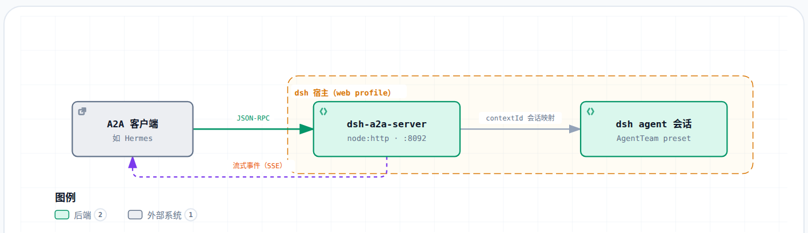

# dsh-a2a-server

[English](README.en.md) | **简体中文**

dsh 侧的 A2A (Agent2Agent) server 插件库：把 dsh agent 会话以 A2A 协议暴露给远端
agent（如 Hermes），实现「Hermes = brain，dsh = arms」的互操作。

## 效果

以下效果由本库的 A2A 服务端与流式事件驱动，客户端侧渲染由
[hermes-a2a-bridge](https://github.com/ArtomYuan/hermes-a2a-bridge) 完成（工具命令 /
执行结果 / 最终文本的代码框渲染、进度推送到飞书 / QQ）。

### 直播流样式

投递一个 dsh 任务后，客户端边消费 SSE 流边把中间进度实时推回消息面，用户在
飞书 / QQ 里看到的完整直播序列大致如下（命令与结果以代码框呈现）：

```
🚀 开始执行
🧠 思考中…
🔧 `bash`                    ← 工具调用，命令进代码框
    ┌─ ```bash
    │  ls -la /tmp
    └─ ```
📋 `bash` 完成               ← 工具结果，输出进代码框
    ┌─ ```
    │  total 4
    │  drwxrwxrwt  2 root root 40 Sep 11 14:00 .
    └─ ```
📖 输出完成                  ← 长结果以代码框输出
✅ 完成
```

长文本超过网关单条上限时按代码块边界分块，块间以 `⏩ 续` 提示衔接，代码框不会
跨块断裂。

### 代码框效果

操作内容——工具命令、执行结果、最终文本——会自动以代码框渲染：

- **飞书**：含代码围栏的内容触发 post 富文本，代码框可滚动查看；
- **QQ / 其它主流网关**：markdown 代码块渲染为代码框；
- **纯文本平台**：自动降级为普通文本（不产生乱码）。

代码框内效果示意（`ls -la` 输出块）：

```text
total 4
drwxrwxrwt  2 root root 40 Sep 11 14:00 .
drwxrwxrwt  2 root root 40 Sep 11 14:00 ..
-rw-r--r--  1 root root  0 Sep 11 14:00 demo.txt
```

> 实际效果以各网关客户端渲染为准。

### 事件流侧面

本库产出的流式事件形态示意（`SendStreamingMessage` 下，text Part + data Part
私有扩展，字段取自源码 `StreamEventDescriptor`）：

```
artifactUpdate  artifactId: "stream-text"  append: true         ← 文本块，text Part
artifactUpdate  artifactId: <uuid>  mediaType: application/json  ← 中间事件，data Part
  kind: "tool_call"    { turn, step, name, arguments }
  kind: "tool_result"  { turn, step, name, text }
  kind: "thinking"     { turn, step, text }
  kind: "turn_start"   { turn, step }
  kind: "turn_end"     { turn, step, reason? }
statusUpdate   submitted → working → completed
```

完整字段与机制见 [CONFIGURATION.md](CONFIGURATION.md)。

## 流程图



## 安装说明

本库是独立公开 bundle 包（非 dsh workspace 内包），以 standalone bundle 形态分发。

1. 装进 dsh profile（开发期推荐 GitHub 安装，**必须固定 commit**）：

   ```sh
   dsh plugin --profile <name> add github:ArtomYuan/dsh-a2a-server#<commit>
   ```

   首次 `add` 会因 pnpm ≥10 默认拒绝 git 依赖的 `prepare` 脚本而失败，按提示把包键
   加入 profile 的 `pnpm-workspace.yaml` 后重跑：

   ```yaml
   allowBuilds:
     dsh-a2a-server: true
   ```

2. 在 profile 的 cordis 配置里给 A2A server 插件填最小配置（`port` / `authToken` /
   `preset`）：

   ```yaml
   - id: a2a-server
     config:
       port: 8092
       authToken: <token>
       preset: standard
   ```

   `token` 需与 Hermes 侧 `a2a_agents.dsh.auth.token` 一致。

## 链接

- 详细配置与机制说明：[CONFIGURATION.md](CONFIGURATION.md)
- 变更记录：[CHANGELOG.md](CHANGELOG.md)
- 许可证：[License & Attribution](#license--attribution)

## License & Attribution

本项目以 GNU General Public License v3.0（GPL-3.0）分发，全文见 `LICENSE`。部分实现
（agent 会话接管 / agentLocks / origin-map 会话复用模式）移植自
[chushixixin/dsh-harness-mcp-server](https://github.com/chushixixin/dsh-harness-mcp-server)
（MIT License，Copyright chushixixin），原 MIT 版权声明保留，按 MIT 条款再许可纳入本项目。
