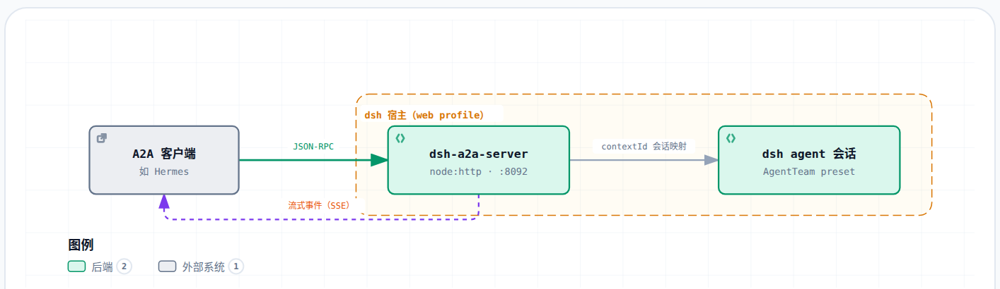

# dsh-a2a-server

[English](README.en.md) | **简体中文**

dsh 侧的 A2A (Agent2Agent) server 插件库：把 dsh agent 会话以 A2A 协议暴露给远端
agent（如 Hermes），实现「Hermes = brain，dsh = arms」的互操作。

## 效果

以下效果由本库的 A2A 服务端与流式事件驱动，客户端侧渲染由
[hermes-a2a-bridge](https://github.com/ArtomYuan/hermes-a2a-bridge) 完成（工具命令 /
执行结果 / 最终文本的代码框渲染、进度推送到飞书 / QQ）。

### 直播流样式

投递一个 dsh 任务后，客户端边消费 SSE 流边把中间进度实时推回消息面，用户在
飞书 / QQ 里看到的完整直播序列大致如下（命令与结果以代码框呈现）：

```
🚀 开始执行
🧠 思考中…
🔧 `bash`                    ← 工具调用，命令进代码框
    ┌─ ```bash
    │  ls -la /tmp
    └─ ```
📋 `bash` 完成               ← 工具结果，输出进代码框
    ┌─ ```
    │  total 4
    │  drwxrwxrwt  2 root root 40 Sep 11 14:00 .
    └─ ```
📖 输出完成                  ← 长结果以代码框输出
✅ 完成
```

长文本超过网关单条上限时按代码块边界分块，块间以 `⏩ 续` 提示衔接，代码框不会
跨块断裂。

### 代码框效果

操作内容——工具命令、执行结果、最终文本——会自动以代码框渲染：

- **飞书**：含代码围栏的内容触发 post 富文本，代码框可滚动查看；
- **QQ / 其它主流网关**：markdown 代码块渲染为代码框；
- **纯文本平台**：自动降级为普通文本（不产生乱码）。

代码框内效果示意（`ls -la` 输出块）：

```text
total 4
drwxrwxrwt  2 root root 40 Sep 11 14:00 .
drwxrwxrwt  2 root root 40 Sep 11 14:00 ..
-rw-r--r--  1 root root  0 Sep 11 14:00 demo.txt
```

> 实际效果以各网关客户端渲染为准。

### 事件流侧面

本库产出的流式事件形态示意（`SendStreamingMessage` 下，text Part + data Part
私有扩展，字段取自源码 `StreamEventDescriptor`）：

```
artifactUpdate  artifactId: "stream-text"  append: true         ← 文本块，text Part
artifactUpdate  artifactId: <uuid>  mediaType: application/json  ← 中间事件，data Part
  kind: "tool_call"    { turn, step, name, arguments }
  kind: "tool_result"  { turn, step, name, text }
  kind: "thinking"     { turn, step, text }
  kind: "turn_start"   { turn, step }
  kind: "turn_end"     { turn, step, reason? }
statusUpdate   submitted → working → completed
```

完整字段与机制见 [CONFIGURATION.md](CONFIGURATION.md)。

## 流程图



## 与 hermes-a2a-bridge 的关系

本库暴露标准 A2A 接口，不依赖任何特定客户端——其他 A2A 客户端可直接调用。
Hermes 用户如需完整体验（过程直播 / 会话连续性 / 单执行），可搭配
[hermes-a2a-bridge](https://github.com/ArtomYuan/hermes-a2a-bridge)。两库非强绑定，按需组合：

| 组合 | 能实现 |
| --- | --- |
| 只用本库 | 标准 A2A 接口，任意 A2A 客户端可直接调用 |
| 搭配 hermes-a2a-bridge | 完整体验：任务投递 + 过程直播 + 会话连续性 + 单执行 |

## 版本与支持

| 插件版本 | 支持的 dsh |
| --- | --- |
| **0.5.x**（当前） | **0.1.5-rc.2 ∥ 0.2.0-rc.2** —— 双版本并行；0.2.0 上设置区（Settings）与直播流（text/thinking 帧）均可用 |
| 0.4.x | 0.1.5-rc.2 ∥ 0.2.0-rc.2 —— 双版本并行；0.2.0 上设置区可用，但直播流缺 text/thinking 帧 |
| 0.3.x | 0.1.5-rc.2 ∥ 0.2.0-rc.2 —— 双版本并行，同一插件无需切换 |
| 0.2.x | 0.1.x |

0.3.0 起，本插件在 dsh 0.1.5 与 0.2.0 之间升级或回退**无需更换插件**；0.4.0 起 dsh 0.2.0 的设置区（GUI 配置）可用；0.5.0 起 dsh 0.2.0 的直播流（text/thinking 帧）恢复。机制细节见
[CONFIGURATION.md](CONFIGURATION.md)。

## 安装说明

本库是独立公开 bundle 包（非 dsh workspace 内包），以 standalone bundle 形态分发。

1. 装进 dsh profile（二选一）：

   - **从 npm 安装（推荐）**：

     ```sh
     dsh plugin --profile <name> add @artomyuan/dsh-a2a-server
     ```

     需要锁定版本时带上版本号：`dsh plugin --profile <name> add @artomyuan/dsh-a2a-server@0.5.0`。

   - **从 GitHub 源码安装**（用于尝鲜尚未发布的改动；**必须固定 commit**）：

     ```sh
     dsh plugin --profile <name> add github:ArtomYuan/dsh-a2a-server#<commit>
     ```

     首次 `add` 会因 pnpm ≥10 默认拒绝 git 依赖的 `prepare` 脚本而失败，按提示把包键
     加入 profile 的 `pnpm-workspace.yaml` 后重跑：

     ```yaml
     allowBuilds:
       @artomyuan/dsh-a2a-server: true
     ```

2. 在 profile 的 cordis 配置里给 A2A server 插件填最小配置（`port` / `authToken` /
   `preset`）：

   ```yaml
   - id: a2a-server
     config:
       port: 8092
       authToken: <token>
       preset: standard
   ```

   `token` 需与 Hermes 侧 `a2a_agents.dsh.auth.token` 一致。

3. 重启 dsh 以加载新插件（方式取决于你的 dsh 部署）：

   ```bash
   # 示例：systemd 用户级服务
   systemctl --user restart dsh
   ```

## 设置面板

dsh Web UI「设置 → 插件 → Plugin configuration」会自动出现 `a2a-server` 设置卡片，
只要该插件被 profile 组合即可，无需改 dsh 仓库、无需白名单。实现走 dsh 官方
settings 能力：host 侧注册 settings 命名空间 `a2a-server`（schema 由 schemastery
定义），浏览器侧提供一张设置卡。

> **dsh 0.2.0 现状**：0.2.0 无 `installSection`/`register` 注册缝，设置区改由插件
> 导出的运行时 `Config` schema 派生（命名空间仍为 `a2a-server`）。与 0.1.5 的差异：
> 表单编辑落在 **profile 的 `cordis.patch.yml`**（非 `settings.yaml`），且派生区一律报
> `applies: 'live'`，但 `port`/`host`/`contextMapPath` 实际需重启。详见
> [CONFIGURATION.md](CONFIGURATION.md)。

### 配置分层

- `cordis.patch.yml` 里的插件 `config` 仍是 composition（base）层与事实源；
- 面板上的修改写入 dsh 用户设置文档 `$DSH_HOME/settings.yaml`，作为**用户覆盖层**；
- 解析顺序：schema 默认值 < `cordis.patch.yml` < 用户覆盖。

面板会标出哪些字段被用户层覆盖，并提供「清除覆盖」回落到 `cordis.patch.yml` 的值。

### 字段与生效时机

| 字段 | 生效时机 |
| --- | --- |
| `provider` / `model` / `preset` / `cwd` / `authToken` / `contextMapTtlDays` | 保存后下一次 A2A 请求即生效（无需重启） |
| `port` / `host` / `contextMapPath` | 保存后需重启 dsh（或重新加载 profile）才生效；当前运行实例仍监听启动时的地址 |

- `model` 留空（空串）= 跟随 dsh 当前默认模型；`cwd` 留空 = `process.cwd()`；
  `port` 留空 = 启动时自动探测可用端口。

### 凭据（authToken）

- 面板上只写不回显（永远显示「已设置 / 未设置」，输入框空起始；空白输入 =
  不修改）。
- 「清除覆盖」只删除用户层覆盖并回落到 `cordis.patch.yml` 的既有令牌，绝不
  静默关闭鉴权。
- 最终解析值为空时面板显性警示「未设置 = 无鉴权（危险）」。
- 环境变量 `A2A_SERVER_TOKEN` 优先级高于配置，此时面板显示「由环境变量接管」
  而不可编辑。

### 降级

settings 服务不存在时插件照常工作，只使用 `cordis.patch.yml` 的配置。

安装无需额外步骤：`link:` 或正常安装后重启 dsh 即可；发布物同时包含 host 产物
`lib/` 与浏览器产物 `client/`，从 git 安装由 `prepare` 脚本自动构建两半。

## 链接

- 详细配置与机制说明：[CONFIGURATION.md](CONFIGURATION.md)
- 变更记录：[CHANGELOG.md](CHANGELOG.md)
- 许可证：[License & Attribution](#license--attribution)

## License & Attribution

本项目以 GNU General Public License v3.0（GPL-3.0）分发，全文见 `LICENSE`。部分实现
（agent 会话接管 / agentLocks / origin-map 会话复用模式）移植自
[chushixixin/dsh-harness-mcp-server](https://github.com/chushixixin/dsh-harness-mcp-server)
（MIT License，Copyright chushixixin），原 MIT 版权声明保留，按 MIT 条款再许可纳入本项目。
